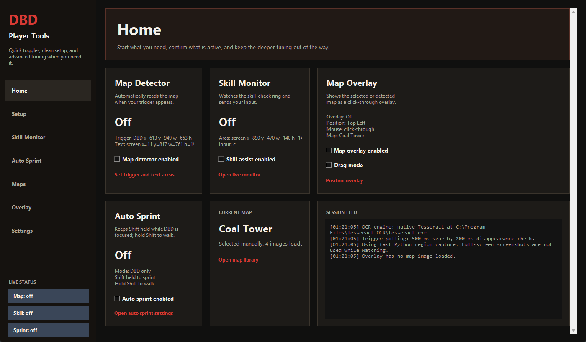

# DBD Player Tools

A lightweight Python companion app for Dead by Daylight. It combines map detection, a click-through map overlay, skill-check assistance, and Auto Sprint in one desktop UI.



## Features

- Map detector that watches a small trigger area and runs OCR only when needed.
- Click-through map overlay with corner placement, size, opacity, and margin controls.
- Map viewer with bundled map images.
- Skill-check monitor with live visual debugging and configurable keyboard or mouse input.
- Auto Sprint mode: holds `Shift` for sprint and lets you hold `Shift` manually to walk.
- Region-only screen capture using `mss`; no Electron, Chromium, or Node runtime.

## Requirements

- Windows
- Python 3.10 or newer
- Tesseract OCR

The included `start-detector.bat` installs Python package requirements automatically and attempts to install Tesseract with `winget` if it is missing.

## Quick Start

Clone the repo, then run:

```powershell
python -m pip install -r requirements.txt
python run.py
```

Or double-click:

```bat
start-detector.bat
```

## First-Time Setup

1. Open `Setup`.
2. Select `Trigger Area` around the visual cue that appears before the map name.
3. Select `Text Area` around the map-name text.
4. Use `Recapture` after changing the trigger area.
5. Open `Maps` to verify the map library and selected map images.
6. Open `Overlay` to enable the map overlay and choose the corner, size, transparency, and margin.

The trigger template is generated locally at runtime and is intentionally ignored by git.

## Skill Monitor

The skill-check monitor watches only the selected skill-check region. It detects the white marker zone, tracks the red marker, and sends the configured input when the red marker reaches the target area.

In `Settings`, the `Press input` field accepts keyboard keys and mouse inputs. Quick buttons are included for:

- `C`
- `Space`
- `M1`
- `M2`
- `M3`
- `M4`
- `M5`

`M4` and `M5` are the side mouse buttons. Typed aliases also work, including `mouse4`, `mouse5`, `side1`, `side2`, `xbutton1`, and `xbutton2`.

## Auto Sprint

Auto Sprint holds `Shift` while enabled. When `Only while Dead by Daylight is focused` is enabled, it only affects the DBD window.

Behavior:

- Auto Sprint enabled: app holds `Shift` for sprint.
- Hold physical `Shift`: the app releases synthetic Shift so you walk.
- Release physical `Shift`: sprint resumes.
- Disable Auto Sprint or close the app: Shift is released and the keyboard hook is removed.

## Project Layout

```text
backend/       app logic, detection, OCR, overlay, input helpers
frontend/      small launcher wrapper
assets/maps/   bundled map image library
docs/          README images
run.py         main Python entrypoint
```

## Generated Files

These are local runtime/debug files and are ignored by git:

```text
assets/image-trigger-template.png
assets/debug-image-trigger-current.png
assets/debug-text-area.png
assets/debug-text-area-processed.png
assets/ocr-debug/
assets/skill-check-debug/
assets/map-original-backups/
```

## Notes

The app stores user settings under:

```text
%APPDATA%\dbd-screen-ocr-detector
```

If map detection stops matching after changing the trigger area, recapture the trigger image from the `Setup` page.
